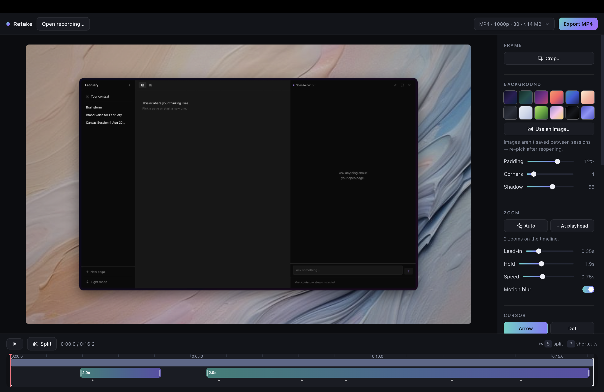

# Retake — your own Screen Studio

That GIF is Retake editing a recording — and the GIF itself was recorded,
edited and exported with Retake. The tool is its own demo.

Retake exists because I couldn't justify the Screen Studio subscription
anymore, so I built my own and gave it away. Claude wrote most of the code;
the design calls, the QA and the taste are mine. My client work ships with it.

A free, two-part replacement for Screen Studio:

1. **Recorder** (`retake`) — a tiny native macOS tool that records your screen
   *without* the cursor, logs every cursor movement and click, and can record your
   webcam + microphone at the same time. Everything lands in one `.take` folder.
2. **Editor** (`retake-editor.html`) — a single HTML file that runs in Chrome.
   Drop the `.take` folder in, press **Auto** and it builds zoom-ins from your clicks,
   redraws a buttery-smooth cursor, adds the gradient framing / rounded corners / shadow,
   overlays your webcam bubble, and exports a polished MP4. No install, no server,
   no account, works offline.

The editor also accepts **any plain video** (QuickTime recordings, OBS captures…) —
you just won't get auto-zoom or the redrawn cursor, since those need the recorder's data.

---

## Install

    curl -fsSL https://raw.githubusercontent.com/tonhaoln/retake/main/install.sh | sh

That downloads the latest release, puts `retake` in `/usr/local/bin` and the
editor in `~/Applications/Retake`, and stops. [Read the script first](install.sh)
— it is short, does nothing else, and there is no checksum step, so read it
rather than trusting it.

The binary is ad-hoc signed, not notarised (a notarised build costs $99/year;
it happens if the project earns it). Two consequences worth knowing: a tarball
downloaded in a **browser** gets quarantined by Gatekeeper, while the `curl`
line above does not, and macOS re-asks for permissions after each update
because the grants are tied to the signature.

### Or build it yourself (about 2 minutes)

You need Apple's command line tools (free). If you don't have them:

    xcode-select --install

Then build the recorder:

    cd Recorder
    swift build -c release
    sudo mkdir -p /usr/local/bin
    sudo cp .build/release/retake /usr/local/bin/

**Permissions** — the first time you record, macOS will ask (or silently block) until
you grant your terminal app (Terminal / iTerm / Warp) these, under
**System Settings → Privacy & Security**:

- **Screen Recording** — required, for the capture itself
- **Accessibility** — recommended, lets it see your clicks (that's what powers auto-zoom)
- **Camera / Microphone** — only if you use `--webcam` / `--mic`

After granting Screen Recording you must quit and reopen the terminal app once.

## Recording

    retake                    # main display + system audio
    retake --webcam           # + webcam bubble + mic
    retake --mic              # + mic voiceover, no webcam
    retake --window safari    # record one window (see --list for names)
    retake --area 100,80,1280,720   # record a region (points, from top-left)
    retake --display 1        # record your second display
    retake --list             # show displays and windows
    retake --keys             # ALSO record which keys you press (see below)
    retake --no-system-audio  # skip app/system sound
    retake --no-notify        # skip the "Saved" notification
    retake --fps 30           # lighter files
    retake --out ~/Movies     # save somewhere other than ~/Desktop/Retake

Stop with **Ctrl+C** in the terminal — or **⌃⎋ (Control+Escape)** from any app.
You get a folder like `~/Desktop/Retake/2026-07-29 14.03.12.take` containing
the raw video (with system audio), cursor data, and webcam/mic track.

One thing about `--window`: the cursor is logged against the window's starting
position, so don't move the window mid-recording.

If something goes wrong mid-recording — you close the terminal, the machine
gives up, you force-quit — the take survives. Closing the terminal stops it
cleanly, and a hard crash costs you the last few seconds rather than the whole
session: the video is written in fragments and the cursor data is flushed to
disk as you go.

Privacy note: by default the recorder logs *when* keys are pressed but never
*which* keys. Full detail in [Privacy](#privacy) below.

## Editing

1. Open `retake-editor.html` in **Chrome** (or Edge/Arc — anything Chromium).
   Tip: keep it in your Dock — it's just a file.
2. Drag the `.take` folder into the window. (Recordings made before the
   rename — `.osrec` folders — open exactly the same, edits included.)
3. Press **Auto** in the Zoom section to build zooms from your clicks (nothing is
   added until you ask, so a recording never opens with zooms you didn't choose).
   Then:
   - **Timeline**: drag zoom blocks to move them, drag their edges to resize,
     double-click empty space to add one, ⌫ deletes the selected one.
   - **Selected zoom**: drag the dashed ring on the preview to aim it, use the
     Level slider for intensity.
   - **Zoom timing**: the Lead-in / Hold / Speed sliders control how early a zoom
     starts before each click, how long it lingers after, and how fast the camera
     moves. Once you've pressed Auto, adjusting them rebuilds those zooms live
     (zooms you added by hand are left alone).
   - **Sidebar**: background gradients or your own image; padding, corner radius,
     shadow; cursor style (arrow / dot / halo / hidden), size, smoothing and click
     ripples; hide-when-idle (cursor fades out after a configurable pause and
     returns the instant it moves — clicks count as activity); motion blur on
     camera moves; keystroke display (if recorded with `--keys`); webcam corner,
     shape and size.
   - **Audio**: separate microphone and system-audio toggles + volumes, and
     optional click sounds mixed into the export.
   - **Crop**: Frame → Crop… — drag a box (or snap to 16:9 / 4:3 / 1:1 / 9:16, or set a custom ratio like 21 : 9)
     to trim away the dock, menu bar, or anything else. Zooms and the cursor
     follow the crop automatically. Arrow keys nudge the box one pixel (⇧ for
     ten, ⌥ resizes), and the align buttons snap it flush or centred.
   - **Cut sections**: press ✂ Split (or S) at the playhead, click a piece,
     press ⌫ to remove it. Click a hatched cut to select it and ⌫ restores it.
     Audio, zooms and click sounds all stay in sync across cuts.
   - **Halo cursor**: a clearly-visible tinted disc around the cursor (white by
     default; tints + glow strength in the Cursor panel), no arrow on top.
   - **Trim**: drag the ⟨ ⟩ brackets on the timeline — they snap to your
     splits and the playhead (hold ⌥ to drag free).
   - **Your look**: "Make this my default style" makes the current settings the
     default for every recording that opens without edits of its own (edited
     recordings keep theirs). The last three saved looks stack under the
     button; clicking one makes it the default again and applies it.
   - **Undo**: ⌘Z / ⇧⌘Z walks timeline and crop edits back and forward (not
     while you're inside crop mode — Esc cancels that instead).
   - Press **?** for all keyboard shortcuts.
4. The chip next to **Export** shows your settings (format · resolution · fps ·
   ≈ size) — click it to change format (MP4/GIF), quality, resolution and frame
   rate. Hit **Export**; rendering runs in the browser at roughly real-time
   speed (measured: a five-second clip with zooms and motion blur exports in
   about six seconds at 1080p30 on an Apple-silicon MacBook) and the file
   downloads when done. (GIF ignores the resolution picker
   and renders at up to 960px / 15 fps — right for READMEs and PRs.)

Your edits are **saved automatically** (in the browser, per recording) — close the
tab, come back tomorrow, drop the same `.take` folder in, and everything is where
you left it. The save lives in that browser's storage, so edits you made in
Chrome won't show up if you reopen the editor in Arc or Edge. Same browser and
they're there.

## How it works (the trick)

Screen Studio's polish comes from *not* baking the cursor into the recording.
Retake does the same: the screen is captured cursor-free, the cursor path is
recorded as data, and the editor re-renders a smoothed, resizable cursor on top —
which is also why zooming stays tack-sharp on the pointer.

## Known limitations

Named here so nobody has to discover them:

- **Wide-gamut colour survives recording but clips at export.** Takes are
  tagged with your display's real colour space (Display P3 on most modern
  Macs) and play back with correct colour everywhere. The editor composites
  in sRGB, so the small slice of colours outside sRGB is gently clipped in
  exports. Full-gamut export is on the list.
- **Deleting one auto-zoom doesn't survive the timing sliders.** While other
  auto-zooms remain, touching Lead-in or Hold rebuilds the whole auto set and
  the deleted one comes back. Deleting them all sticks, and zooms you added
  by hand are never touched.
- **Custom background images aren't saved between sessions** — re-pick after
  reopening. Gradients and every other setting persist.
- **Your edits and your default look live in one browser's storage.** Edit in
  Chrome, reopen in Arc, and they won't follow you. A project file inside the
  `.take` folder is the planned fix (see Roadmap).
- **The timeline is a drawn canvas**: fully usable by pointer and keyboard
  shortcuts, invisible to screen readers. The sidebar controls are ordinary
  accessible elements; the timeline itself isn't yet.

## Roadmap

In the order they're planned — planned, not promised:

1. **Project file in the folder** — edits move out of browser storage into
   the `.take` itself, so they travel with the recording.
2. **MCP server** — drive the editor from an agent: *"open this morning's
   take, zoom in on every click, export a GIF for the PR"* typed over coffee.
3. **Menu-bar app**, then Homebrew, then a signed DMG if the project earns it.

## Privacy

A screen recorder sees everything. That is exactly why this one is worth
reading rather than trusting.

**Nothing leaves your Mac.** No analytics, no telemetry, no update pings, no
accounts. The recorder writes files to a folder; the editor is an HTML file
that runs offline. There is no network code in either half, and you don't have
to take my word for it:

    grep -rniE 'fetch\(|XMLHttpRequest|WebSocket|EventSource|URLSession|sendBeacon' \
      retake-editor.html Recorder/Sources/retake/App.swift

Zero hits, across both halves of the tool. The shipped editor contains four
`http` URLs in total and all four are comments, crediting where a piece of
code came from.

**Keystrokes are timings, not keys.** By default `cursor.json` contains
exactly four things: cursor positions over time, click positions and times,
the *timestamps* of keypresses, and a flag saying whether click capture
worked. The timestamps exist so the editor can hold a zoom while you type
instead of drifting away mid-sentence. Which key you pressed is never
recorded, never stored, never transmitted.

`--keys` is the explicit opt-in that also records the key labels, so the
editor can draw the on-screen keystroke overlay. Don't use it while typing
passwords. The default recording *cannot* contain your keystrokes, which is
the point: the privacy story survives a mistake.

If you would rather the recorder never watched the keyboard at all, say so in
an issue and a `--no-input` flag is a short patch away.

## Troubleshooting

- **"Could not listen for clicks"** → grant Accessibility to your terminal, rerun.
  Recordings still work; you'd just add zooms manually. The ⌃⎋ stop hotkey needs
  the same permission, so until you grant it, stop with Ctrl+C in the terminal.
- **Black recording / permission error** → grant Screen Recording, then fully quit
  and reopen the terminal app.
- **Webcam file won't play in the editor** → re-encode it in place (keep the name:
  the editor looks for the file `meta.json` names):
  `ffmpeg -i webcam.mov -c:v libx264 fixed.mov && mv fixed.mov webcam.mov`,
  then re-drop the folder.
- **Export has no audio** → your browser lacks an AAC/Opus encoder (rare in Chrome
  on a Mac); update Chrome.
- **4K export refuses to start** → try 1440p; some machines cap the hardware encoder.

## Third-party

The editor bundles two MIT-licensed libraries, inlined by the build so the
shipped file stays a single self-contained HTML document:
[mp4-muxer](https://github.com/Vanilagy/mp4-muxer) (c) Vanilagy, and
[gifenc](https://github.com/mattdesl/gifenc) (c) Matt DesLauriers.
Full notices in [NOTICE](NOTICE).

Everything here is yours — MIT ([LICENSE](LICENSE)). Enjoy not paying a subscription.
